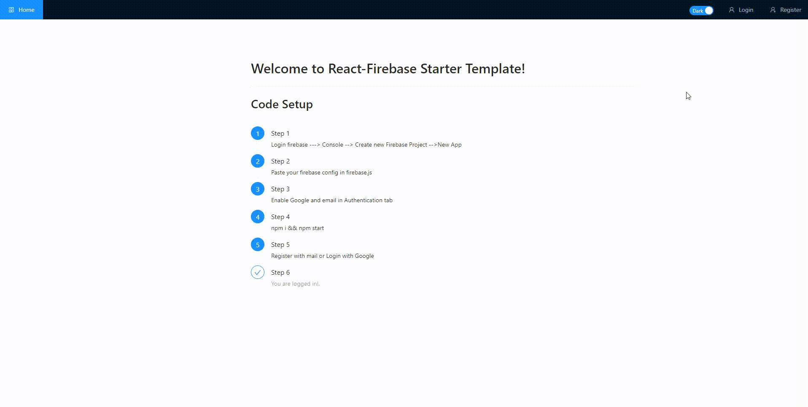

# React Firebase Starter Template 🔥



### Live Preview - https://react-firebase-starter-44276.firebaseapp.com/

## Features
* ✔️ Login with Email.
* ✔️ Login with Google.
* ✔️ Forgot Password reset.
* ✔️ Password Update after login.
* ✔️ Protected Route.
* ✔️ Redirect if not LoggedIn.
* ✔️ Redux State Management.
* ✔️ Light Desgin with Antd Library.
 

## Getting Started

### Firebase Setup

* Login to <a href=https://firebase.google.com/>Firebase</a> & create a new Project.
* After that create a new App and copy the config variable.
* Make sure to go to Authentication tab ---> Sign method in the console and select Email and Google Authentication as we are using these for the setup.
* Type localhost in the authorized domains you can change this later after deployment to your custom domain


### Development Setup

* Install the code to your local machine
```
git clone https://github.com/roy-sukrit/React-Firebase-Starter-Template.git
npm install
```
* Paste the config variable in src / firebase .js and start the server.
```
import firebase from 'firebase'

var firebaseConfig = {
 //paste your config here
};

  // Initialize Firebase
  firebase.initializeApp(firebaseConfig);

//firebase methods  
export const auth = firebase.auth();
export const googleAuthProvider = new firebase.auth.GoogleAuthProvider()
```

```
 npm start 
```

Pull requests are more than welcomed!

#### Features to add

* Better UI
* Chatbot
* Better error handling
* Admin Dashboard
